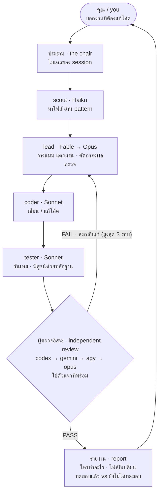

# ai-crew

**ทีมงาน AI หลายโมเดลสำหรับ Claude Code**
A multi-model engineering crew for Claude Code — plan, build, review, repeat.

[](#ติดตั้ง--install) [](LICENSE) [](INSTALL-TH.md)

---

## นี่คืออะไร / What is this

ปกติเวลาใช้ AI เขียนโค้ด เราใช้โมเดลตัวเดียวทำทุกอย่าง — คิด เขียน ตรวจ ซึ่งมีปัญหา 2 ข้อ: **โมเดลแพงถูกใช้ทำงานง่ายๆ ไปด้วย** (เปลือง token) และ **คนเขียนโค้ดเป็นคนตรวจโค้ดตัวเอง** (จุดบอดซ้ำกัน บั๊กเดิมไม่ถูกเจอ)

`ai-crew` แก้ทั้งสองข้อด้วยการแบ่งงานเป็นทีม:

- **หัวหน้า (lead)** — Fable → Opus สลับอัตโนมัติเมื่อติดลิมิต ทำเฉพาะงานคิด: วางแผน แตกงาน ตัดสินใจ architecture คัดกรองผลตรวจ เขียนรายงาน
- **ลูกน้อง (workers)** — Sonnet เขียนโค้ดและรันเทส, Haiku หาไฟล์/อ่านโครงสร้าง/เขียนเอกสาร
- **ผู้ตรวจอิสระ (independent reviewer)** — **Codex / Gemini / Antigravity CLI** ซึ่งเป็นโมเดล*คนละค่าย*กับคนเขียน จึงมีจุดบอดคนละแบบ ตรวจแล้วส่งกลับมาให้หัวหน้าคัดกรอง วนแก้จนผ่าน (สูงสุด 3 รอบ)

จบงานได้รายงานหน้าเดียว **ในภาษาที่คุณพิมพ์มา** บอกว่าแต่ละโมเดลทำอะไร ไฟล์ไหนเปลี่ยนบ้าง อะไรทดสอบแล้วจริง และอะไรที่คุณต้องไปกดดูเอง

> In short: a **lead model** plans and splits the work, **cheaper worker models** build and test, and an **independent reviewer from another vendor** checks the diff. The loop repeats until it passes, then you get a one-screen report in your own language.



<sub>ถ้าแผนภาพไม่ขึ้น ดูภาพนิ่งที่ <a href="docs/crew-flow.png">docs/crew-flow.png</a></sub>

---

## ทำไมถึงออกแบบแบบนี้ / Why

| เหตุผล | Reason |
|---|---|
| **คนละค่าย จุดบอดคนละแบบ** — โมเดลที่เขียนโค้ดไม่ควรเป็นคนเดียวที่ตรวจ | Different vendor, different blind spots |
| **ใช้โมเดลแพงเฉพาะตอนคิด** — อ่านไฟล์/เขียนเอกสารให้ Haiku, เขียนโค้ดให้ Sonnet, เหลือหัวหน้าไว้วางแผนกับตัดสินใจ | Spend the expensive model only on thinking |
| **ไม่คิดไปเอง ต้องมีหลักฐาน** — ทุกข้อสรุปต้องแนบผลรันคำสั่งหรือ `ไฟล์:บรรทัด` คำว่า "ทดสอบแล้ว" แปลว่ารันจริงและมี output ส่วนอะไรที่รันไม่ได้จะถูกแยกไว้ให้คุณทดสอบเอง | Evidence, not confidence |
| **ติดลิมิตแล้วไม่เสียงาน** — หัวหน้าสลับโมเดลเอง และสถานะงานอยู่ใน `.crew/state.md` เปิด session ใหม่แล้วพิมพ์ "ทำต่อ" ได้ทันที | Survives rate limits |

---

## ติดตั้ง / Install

> **repo นี้เป็นสาธารณะ (public) และเป็น MIT license** — ใครก็ติดตั้งได้เลย ไม่ต้องมีบัญชี GitHub ไม่ต้องขออนุญาต จะ fork ไปแก้เป็นของตัวเองก็ได้
> *This repo is **public** and MIT-licensed — anyone can install it, no GitHub account or permission needed. Fork it freely.*

พิมพ์ใน **Terminal** (ไม่ใช่ช่องแชท) — run these in a **terminal**, not in the chat box:

```bash
claude plugin marketplace add chivaszxchannel/ai-crew
claude plugin install ai-crew@bm-plugins
```

บรรทัดที่สองไม่ได้พิมพ์ผิดนะครับ — `ai-crew` คือชื่อ **plugin** ส่วน `bm-plugins` คือชื่อ **marketplace** ที่ประกาศไว้ใน `.claude-plugin/marketplace.json` ไม่จำเป็นต้องตรงกับชื่อ repo
*(Not a typo: `ai-crew` is the plugin, `bm-plugins` is the marketplace name declared in `.claude-plugin/marketplace.json`.)*

จากนั้น **รีสตาร์ท Claude Code** แล้วทำ 2 ขั้นนี้ / then restart Claude Code and run:

```
/crew-setup      ครั้งเดียวต่อเครื่อง — ติดตั้ง + login ผู้ตรวจ   (once per machine)
/crew-config     ครั้งเดียวต่อโปรเจกต์ — เลือกโมเดล/โหมด/กติกา   (once per project)
```

> **ไม่มี Codex หรือ Gemini ก็ใช้ได้** ปลั๊กอินจะใช้ Opus เป็นผู้ตรวจแทนอัตโนมัติ และระบุเหตุผลในรายงานทุกครั้ง
> *No Codex or Gemini? It falls back to an Opus reviewer automatically and says so in the report.*

รองรับ Claude Code CLI, extension ใน VS Code / JetBrains, Claude Cowork และ IDE ที่ fork จาก VS Code เช่น Antigravity

---

## ตั้งค่าด้วยหน้าเว็บ / Visual settings page

ไม่ต้องแก้ JSON เอง พิมพ์ `/crew-config ui` แล้วหน้าตั้งค่าจะเปิดในเบราว์เซอร์ทันที

*No JSON editing. Type `/crew-config ui` and a settings page opens in your browser.*

```
/crew-config ui
```

<p align="center">
  <picture>
    <source media="(prefers-color-scheme: dark)" srcset="docs/config-ui-dark.png">
    
  </picture>
</p>

หน้าเดียว 6 การ์ด เลื่อนลงทีเดียวจบ

| การ์ด | เลือกอะไรได้ |
|---|---|
| **1 ขอบเขต / Scope** | บันทึกลงโปรเจกต์นี้ (`.crew/config.json`) หรือเป็นค่าเริ่มต้นของทุกโปรเจกต์ (`~/.claude/ai-crew.json`) |
| **2 โหมด / Mode** | กดการ์ด `eco` `normal` `strict` แล้วช่องโมเดลด้านล่างเปลี่ยนตามทันที ปรับต่อเองได้ |
| **3 โมเดล / Models** | dropdown 3 ช่องต่อบทบาท เรียงเป็นสายสำรอง เช่น `fable → opus → inherit` ครบทั้ง lead, coder, tester, scout, writer |
| **4 ผู้ตรวจ / Reviewers** | ติ๊กเลือก + ลูกศรจัดลำดับ พร้อม**ป้ายสถานะสด** — พร้อมใช้ / ยังไม่ login / ยังไม่ติดตั้ง — และปุ่ม **ติดตั้ง** กับ **Login** |
| **5 อื่นๆ / Options** | จำนวนรอบตรวจ, ภาษาที่ตอบ, โหมดอัตโนมัติ (ทุกงาน / เฉพาะ 2 ไฟล์ขึ้นไป / ปิด), นโยบาย git |
| **6 กติกาโปรเจกต์ / Rules** | เลือก template โดยระบบเดา stack ให้ก่อนแล้ว → เขียน `.crew/rules.md` ให้ |

### ปุ่ม Login ทำงานยังไง / How sign-in works

<p align="center">
  <picture>
    <source media="(prefers-color-scheme: dark)" srcset="docs/reviewers-dark.png">
    
  </picture>
</p>

กดปุ่ม **Login** แล้ว **หน้าต่าง terminal เด้งขึ้นมาจริง** พร้อมรันคำสั่ง login ของเจ้านั้นเอง (`codex login`, `gemini`, `agy`) ตัว CLI จะเปิดหน้าเว็บ login ให้ พอเสร็จแล้วกลับมากด **ตรวจสถานะอีกครั้ง** ในหน้าตั้งค่า ป้ายจะเปลี่ยนเป็นเขียว ปุ่ม **ติดตั้ง** ก็เหมือนกัน เด้งหน้าต่างรัน `npm install -g` ให้เห็นความคืบหน้า

> **หน้านี้ไม่ขอ ไม่เห็น และไม่เก็บรหัสผ่านหรือ token ใดๆ** มันแค่เรียกคำสั่ง login ของเจ้าของ CLI ขึ้นมาให้คุณทำเอง
> *The page never asks for, sees, or stores any password or token — it only launches the vendor's own login command for you.*

### ความปลอดภัย / Security

เป็น local server ที่สั่งติดตั้งโปรแกรมได้ จึงกันไว้ 4 ชั้น: ผูกกับ `127.0.0.1` เท่านั้น เครื่องอื่นในวงแลนเข้าไม่ได้ · ต้องมี token สุ่มในลิงก์ เว็บอื่นที่เปิดอยู่ยิงคำสั่งมาไม่ได้ · ปฏิเสธ request ข้าม origin · ปิดตัวเองอัตโนมัติหลังไม่ใช้งาน 30 นาที

ไม่ต้องติดตั้งอะไรเพิ่ม ไม่มี npm dependency เป็นไฟล์ Node ไฟล์เดียว (`ai-crew/tools/config-ui.mjs`) เปิดตรงๆ ก็ได้

```bash
node "<plugin>/tools/config-ui.mjs" --project .        # เปิดเบราว์เซอร์ให้เอง
node "<plugin>/tools/config-ui.mjs" --no-open --port 8790   # ไม่เปิดเอง ใช้ลิงก์ที่พิมพ์ออกมา
```

บันทึกแล้วมีผลกับ `/crew` ครั้งถัดไปทันที **ไม่ต้องรีสตาร์ท Claude Code** และถ้าไฟล์เดิมมีอยู่ จะ backup เป็น `.bak_YYYYMMDD` ให้ก่อนเสมอ

---

## ใช้งาน / Usage

| คำสั่ง / Command | ทำอะไร / What it does |
|---|---|
| *พิมพ์งานตามปกติ* | **โหมดอัตโนมัติ** — งานที่ต้องแก้ไฟล์ ทีมรับเอง ส่วนคำถามตอบตรงๆ · *auto mode: the crew starts by itself; questions get direct answers* |
| `/crew <งาน>` | บังคับใช้ทีม + flag: `--eco` `--strict` `--rounds N` `--lang th` |
| `ทำต่อ` / `/crew-resume` | ทำงานค้างต่อหลังสลับโมเดลหรือเปิด session ใหม่ · *resume an in-progress job* |
| `/crew-config` | เปลี่ยนโมเดล / ผู้ตรวจ / โหมด / กติกา แบบกดเลือก · *click-through wizard* |
| `/crew-setup` | ติดตั้งและตรวจ CLI ของผู้ตรวจ · *install & verify reviewer CLIs* |
| *"ไม่ต้องใช้ทีม"* | ข้ามทีมเฉพาะข้อความนั้น · *skip the crew for this message* |

**3 โหมดสำเร็จรูป / three presets**

| โหมด | ใช้เมื่อไหร่ | ทีม |
|---|---|---|
| `eco` | งานเล็ก หรือโควตาใกล้หมด | หัวหน้า Sonnet · ลูกน้อง Haiku · ตรวจ 1 รอบ |
| `normal` | งานทั่วไป (ค่าเริ่มต้น) | หัวหน้า Fable→Opus · Sonnet เขียน · ตรวจ 3 รอบ |
| `strict` | งาน auth / เงิน / ย้ายข้อมูล | Opus เขียน · ผู้ตรวจ 2 ค่ายต้องผ่านทั้งคู่ · 4 รอบ |

---

## ตั้งค่า / Configuration

ค่าทุกอย่างปรับได้ ไม่ต้องแก้โค้ดปลั๊กอิน — ลำดับทับกัน (ล่างชนะบน) / layers, later wins:

`config/defaults.json` → โหมด → `~/.claude/ai-crew.json` → `<project>/.crew/config.json` → flag ตอนสั่ง

```json
{
  "language": "auto",
  "models": {
    "lead":   ["fable", "opus", "inherit"],
    "coder":  ["sonnet", "haiku"],
    "tester": ["sonnet", "haiku"],
    "scout":  ["haiku", "sonnet"],
    "writer": ["haiku", "sonnet"]
  },
  "reviewers": ["codex", "gemini", "opus"],
  "max_rounds": 3,
  "auto_mode": true,
  "git": { "commit": "never" }
}
```

ค่าโมเดลเป็น **รายการสำรอง (fallback chain)** — ลองตัวแรกก่อน ถ้าติดลิมิต/ล่ม ข้ามไปตัวถัดไปเอง และจดไว้ในรายงานว่าสลับตอนไหนเพราะอะไร `inherit` = โมเดลของ session ปัจจุบัน

**กติกาต่อโปรเจกต์ (`.crew/rules.md`)** — ปลั๊กอินเดา stack จากไฟล์ในโปรเจกต์แล้วก็อป template มาให้: PHP บน shared hosting · Next.js + Supabase · Node/Python · generic แก้เองได้ตลอด ทีมจะอ่านทุกครั้งและส่งท่อนกติกาให้ลูกน้องทุกตัว

---

## สร้างรูปประกอบ (ตัวเลือกเสริม) / Image generation (optional)

บางโปรเจกต์ต้องการรูปที่ยังไม่มี — hero, banner, `og:image`, รูป placeholder ถ้าเครื่องมี **Antigravity CLI (`agy`)** ทีมสร้างให้ได้

```
/crew-image ภาพบ่อตกปลายามเย็น มุมต่ำเหนือผิวน้ำ แสงอุ่น ไม่มีคน ไม่มีตัวหนังสือ
```

หรือปล่อยให้ทีมสร้างเองเมื่อแผนงานต้องใช้รูป (เช่นสร้างหน้า landing แล้วยังไม่มี hero)

**สิ่งที่ทำให้ต่างจากการสั่งเจนภาพเฉยๆ** คือมัน **วัดขนาดจริงจาก header ของไฟล์** แล้วเทียบกับที่ขอ ถ้าไม่ตรงและในเครื่องไม่มี ffmpeg/ImageMagick ให้ crop มันจะ**บอกตรงๆ ว่าได้ขนาดเท่าไหร่จริง** ไม่ใช่รายงานขนาดที่ขอไป และทุกไฟล์ที่สร้างจะถูกระบุในรายงานว่า **เป็นภาพที่ AI สร้าง** เสมอ

*It measures the real pixel size from the file header instead of trusting the request, and always labels the output as AI-generated. Exit code is the verdict: 0 matched · 1 written but wrong size · 2 provider unavailable · 3 nothing produced.*

เปิด/ปิดได้ที่ `image.provider` (`agy` หรือ `none`) ใน `/crew-config` · ใช้โควตาบัญชี Google เดียวกับ Gemini/Antigravity · **ไม่สร้าง**รูปคนจริง โลโก้ เครื่องหมายการค้า ตัวละครมีลิขสิทธิ์ หรืออะไรที่ทำให้เข้าใจผิดว่าเป็นภาพถ่ายจริง

---

## สิ่งที่ทีมไม่ทำให้เด็ดขาด / What it never does

ไม่ `git commit` · ไม่ push · ไม่ลบไฟล์ · ไม่อัปโหลดขึ้น server · ไม่แตะไฟล์ credential — เว้นแต่คุณสั่งในข้อความนั้นเอง
และ **backup ทุกไฟล์ก่อนแก้** เป็น `<ไฟล์>.bak_YYYYMMDD` พร้อมรักษา line ending และ encoding เดิม

*Never commits, pushes, deletes, deploys, or touches credential files unless you ask in that message. Always backs up before editing.*

---

## เอกสาร / Documentation

| ลิงก์ | เนื้อหา |
|---|---|
| **[INSTALL-TH.md](INSTALL-TH.md)** | **คู่มือติดตั้งและใช้งานภาษาไทยฉบับเต็ม** 11 หัวข้อ — ติดตั้ง 3 วิธี, login ผู้ตรวจ, ตาราง `/crew-config`, ตารางแก้ปัญหา 13 อาการ, ข้อจำกัดที่ควรรู้ |
| [ai-crew/README.md](ai-crew/README.md) | Full English documentation |
| [CHANGELOG.md](CHANGELOG.md) | ประวัติการเปลี่ยนแปลงทุกเวอร์ชัน · changelog |
| [LICENSE](LICENSE) | MIT |

---

## ข้อจำกัดที่ควรรู้ / Known limits

- ปลั๊กอิน **เปลี่ยนโมเดลของ session เองไม่ได้** (Claude Code ไม่เปิดให้ทำ) สิ่งที่สลับอัตโนมัติคือ "สมองหัวหน้า" ที่ถูกเรียกเป็น agent — ถ้าทั้งบัญชีติดลิมิต ทีมจะบันทึกสถานะแล้วบอกให้คุณ `/model` เอง
- **Codex CLI ใช้โควตาร่วมกับแอป Codex** ของบัญชี ChatGPT เดียวกัน · Gemini/Antigravity ใช้โควตาบัญชี Google
- **โหมดอัตโนมัติทำให้งานเล็กช้าลงและเปลืองโควตา** เพราะผ่านทีมและผู้ตรวจ ปรับได้ด้วย `auto_mode_min_files: 2`

---

## ร่วมพัฒนา / Contributing

ยินดีรับ issue และ pull request ทุกแบบ — เพิ่ม template กติกาของ stack ที่คุณใช้, เพิ่มผู้ตรวจเจ้าใหม่, แก้บั๊กของสคริปต์บน OS ที่ผมทดสอบไม่ได้ หรือแค่มาเล่าว่าใช้แล้วเป็นยังไง

*Issues and PRs welcome — new stack rule templates, new reviewer CLIs, fixes for platforms I could not test, or just tell me how it went.*

การแก้ปลั๊กอิน: Claude Code จะก็อปปลั๊กอินที่ติดตั้งแล้วไปไว้ที่ `~/.claude/plugins/cache/<marketplace>/ai-crew/<version>/` ดังนั้นหลังแก้ต้นฉบับต้อง **เพิ่มเลข version** ทั้งใน `ai-crew/.claude-plugin/plugin.json` และ `.claude-plugin/marketplace.json` แล้วรัน `claude plugin update ai-crew@bm-plugins` และรีสตาร์ท ตรวจโครงสร้างด้วย `claude plugin validate ai-crew/.claude-plugin/plugin.json`

---

MIT License · สร้างโดย BM ด้วย Claude · [github.com/chivaszxchannel/ai-crew](https://github.com/chivaszxchannel/ai-crew)
