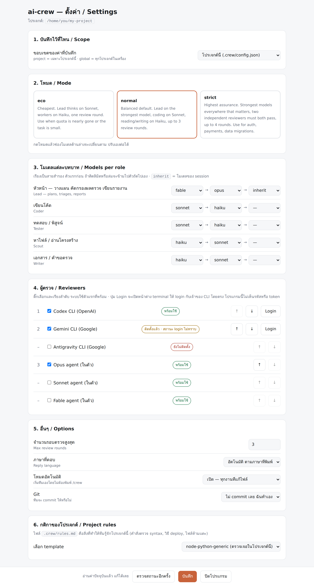
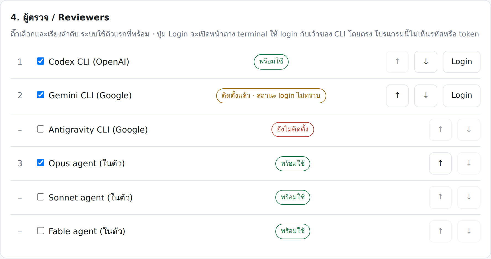

# ai-crew — a multi-model engineering crew for Claude Code

One lead model plans and splits the job. Cheaper worker models build and test. An **independent reviewer from another vendor** (Codex, Gemini or Antigravity CLI) checks the diff. The loop repeats until it passes. You get a short report, in your language, saying what each model did and which files to deploy.

Works anywhere Claude Code runs: the CLI, the VS Code / JetBrains extensions, and Claude Cowork.

```
you ──► chair (session model) ──► scout (haiku) ──► lead-brain (fable → opus) plans
                                       │
                                       ├──► coder (sonnet) ──► tester (sonnet) ──► review request
                                       │                                              │
                                       │            codex ──► gemini ──► opus agent  ◄┘  (first available)
                                       │                       │
                                       └──── lead triages ◄────┘  FAIL → fix → next round (max 3)
                                                     PASS → report: who did what · changed files · tested vs. not
```

## Why

- **Different vendor, different blind spots.** The model that wrote the code should not be the only one checking it.
- **Spend the expensive model only on thinking.** Planning, triage and the report go to the lead; reading and writing go to Haiku; coding to Sonnet.
- **Evidence, not confidence.** Every claim in the report is backed by a command output or a `file:line`. "Tested" means it ran. Anything not run is listed for you to test.
- **Survives limits.** The lead fails over between models automatically; the job state lives in `.crew/state.md`, so a new session or a `/model` switch picks up where it stopped.

## Install

**From GitHub (marketplace):**
```
claude plugin marketplace add chivaszxchannel/ai-crew
claude plugin install ai-crew@bm-plugins
```

**From a local folder:** clone or unzip, then
```
claude plugin marketplace add C:\path\to\bm-plugins      # folder that contains .claude-plugin/marketplace.json
claude plugin install ai-crew@bm-plugins
```
The VS Code extension does not accept `/plugin` in its chat box — run the two commands in the integrated terminal, then reload the window. Cowork: accept the `.plugin` file card.

**Then, once per machine:** `/crew-setup` — checks Node, installs and signs in the CLI reviewers you configured (Codex: `npm i -g @openai/codex` + `codex login`; Gemini: `npm i -g @google/gemini-cli`), verifies the agents, and dry-runs the review chain.

**Then, once per project:** `/crew-config` — a click-through wizard (or `/crew-config ui` for a settings page in your browser) that writes `.crew/config.json` (models, mode, reviewers, rounds, language, git policy) and `.crew/rules.md` from a stack template (PHP on shared hosting, Next.js + Supabase, Node/Python, generic).

## Use

| Command | What it does |
|---|---|
| just describe a code change | **auto mode** (default on): the crew starts by itself for anything that touches project files; questions are answered directly. Add "no crew" to skip. |
| `/crew <task>` | force the crew. Flags: `--eco` `--normal` `--strict` `--rounds N` `--lang th` `--no-auto` |
| `/crew-resume` or "continue" | pick up an in-progress job after a new session or `/model` switch |
| `/crew-config` | change models / mode / reviewers / rules by clicking; `--global` for all projects; `show` to print |
| `/crew-config ui` | open a local settings page in your browser: dropdowns per role, reviewer status, one-click install / sign-in, rules template |
| `/crew-setup` | install and verify reviewer CLIs, dry-run |
| `/crew-image <description>` | generate a picture asset (hero, og:image, icon) with the Antigravity CLI, then measure its real size |

## Visual settings page

```
/crew-config ui
```

Opens a local page in your browser — no JSON editing, nothing to install (single Node file, zero npm dependencies).

<p align="center">
  <picture>
    <source media="(prefers-color-scheme: dark)" srcset="../docs/config-ui-dark.png">
    
  </picture>
</p>

- **Scope** — write to this project (`.crew/config.json`) or to your machine default (`~/.claude/ai-crew.json`)
- **Mode cards** — `eco` / `normal` / `strict`; picking one rewrites the model dropdowns below, which you can still adjust
- **Model dropdowns** — three slots per role, forming the fallback chain (`fable → opus → inherit`) for lead, coder, tester, scout and writer
- **Reviewers** — checkbox + up/down ordering, each row showing live status (ready / not signed in / not installed) with **Install** and **Login** buttons
- **Options** — review rounds, reply language, auto-mode threshold, git policy
- **Rules** — pick a stack template (auto-detected) and it writes `.crew/rules.md`

<p align="center">
  <picture>
    <source media="(prefers-color-scheme: dark)" srcset="../docs/reviewers-dark.png">
    
  </picture>
</p>

**Login button:** it opens a real terminal window running that vendor's own login command (`codex login`, `gemini`, `agy`). The vendor's CLI handles the browser sign-in; come back and press *Re-check status*. The page never asks for, sees, or stores a token.

**Security:** binds `127.0.0.1` only, requires a one-time random token in the URL, rejects cross-origin requests, and exits after 30 minutes idle. Existing files are backed up (`.bak_YYYYMMDD`) before being replaced. Saved settings apply to the next `/crew` run — no restart needed.

Run it directly if you prefer:

```bash
node "<plugin-root>/tools/config-ui.mjs" --project .
node "<plugin-root>/tools/config-ui.mjs" --no-open --port 8790
```

## Configuration

Layers, later wins: `config/defaults.json` → `config/modes.json[mode]` → `~/.claude/ai-crew.json` → `<project>/.crew/config.json` → `/crew` flags.

```json
{
  "language": "auto",
  "mode": "normal",
  "models": {
    "lead":   ["fable", "opus", "inherit"],
    "coder":  ["sonnet", "haiku"],
    "tester": ["sonnet", "haiku"],
    "scout":  ["haiku", "sonnet"],
    "writer": ["haiku", "sonnet"]
  },
  "reviewers": ["codex", "gemini", "opus"],
  "max_rounds": 3,
  "double_review": false,
  "auto_mode": true,
  "auto_mode_min_files": 1,
  "rules_file": ".crew/rules.md",
  "git": { "commit": "never" },
  "deploy": { "manual": true, "list_changed_files": true }
}
```

Each model entry is a fallback chain: on error, rate limit or "unavailable" the next one is tried and the switch is logged in the report. `inherit` = the model running the session.

**Modes:** `eco` (Sonnet lead, Haiku workers, 1 round — for small tasks or when quota is nearly gone) · `normal` (default) · `strict` (Opus coder, two reviewers must both pass, 4 rounds — for auth, payments, migrations).

**Reviewers:** `codex`, `gemini` and `antigravity` (the `agy` CLI) run read-only against `.crew/review-request.md` and are parsed for a `VERDICT: PASS|FAIL` line. `opus` / `sonnet` / `fable` run the built-in `reviewer-fallback` agent. The first available one is used; the report always states which reviewer ran and why others were skipped (`not found` / `not signed in` / `rate-limited`).

Full key reference: `skills/crew/references/config-schema.md`.

## Image generation (optional)

Some projects need a picture that does not exist yet. With the **Antigravity CLI (`agy`)** installed, `/crew-image` produces one — and the crew can produce one itself when a plan calls for an asset.

```
/crew-image a calm freshwater fishing pond at golden hour, low angle across the water,
            reeds in the foreground, warm side light, photographic, no people, no text
```

What makes it different from just asking a model for a picture: the tool **measures the real pixel size from the file header** and compares it with what was requested. The provider defaults to a 1024×1024 square and honours aspect-ratio wording inconsistently, so a mismatch is common — when it happens and neither `ffmpeg` nor `magick` is available to crop, the tool **reports the size it actually got** rather than the size you asked for. Exit code is the verdict: `0` matched · `1` written but wrong size · `2` provider missing / not signed in / rate-limited · `3` nothing produced.

Every generated file is labelled AI-generated in the reply and in the report's changed-files list, and the prompt is recorded in `state.md` so it can be regenerated. It will not generate real identifiable people, logos, trademarks, copyrighted characters, or anything meant to pass as a real photograph or record.

Turn it on or off with `image.provider` (`agy` | `none`) in `/crew-config`. It shares the Google account quota with the Gemini/Antigravity reviewer, so heavy image use can rate-limit reviews — the crew falls back to the agent reviewer and says so.

## What it never does

Commit, push, delete files, deploy, or touch credential files — unless you ask in that message (`git.commit` can be set to `ask` or `auto`). It backs up every file before editing (`file.bak_YYYYMMDD`) and preserves line endings and encoding.

## Files it creates in your project

`.crew/state.md` (team memory), `.crew/config.json`, `.crew/rules.md`, `.crew/review-request.md`, `.crew/review-N-<reviewer>.md|.log`. It adds `.crew/` to `.gitignore` once.

## Limits to know

- The plugin cannot change the model of the running session (Claude Code does not expose that). It fails over the *lead's thinking* between models; if your whole account is rate-limited, it saves state and asks you to `/model` and `/crew-resume`.
- Codex CLI uses your ChatGPT plan's Codex quota (shared with the Codex app). Gemini CLI uses your Google account's quota. `OPENAI_API_KEY` / `GEMINI_API_KEY` switch them to pay-as-you-go if you prefer.
- Auto mode routes every code change through the crew — slower and more quota than a direct edit. Set `auto_mode_min_files: 2` or `auto_mode: false` if that is too much.

## Contributing / editing the plugin

Claude Code copies an installed plugin into `~/.claude/plugins/cache/<marketplace>/ai-crew/<version>`. After editing the source, bump `version` in `.claude-plugin/plugin.json` and `marketplace.json`, run `claude plugin update ai-crew@bm-plugins`, and restart. `claude plugin validate .claude-plugin/plugin.json` checks the structure.

---

## ภาษาไทย (สรุป)

ai-crew คือปลั๊กอินสำหรับ Claude Code ที่ทำงานเป็นทีม: หัวหน้า (Fable → Opus สลับอัตโนมัติ) วางแผนแตกงาน ลูกน้อง Sonnet เขียนโค้ดและทดสอบ Haiku หาไฟล์และเขียนเอกสาร แล้วส่งให้ผู้ตรวจต่างค่าย (Codex CLI → Gemini CLI → Antigravity CLI → Opus) ตรวจบั๊ก วนแก้จนผ่าน แล้วรายงานสั้นๆ ว่าแต่ละโมเดลทำอะไร ไฟล์ไหนต้องอัปโหลด อะไรทดสอบแล้วจริง อะไรต้องกดดูเอง

ติดตั้งครั้งเดียวต่อเครื่อง (`claude plugin marketplace add ...` แล้ว `claude plugin install ai-crew@bm-plugins` ใน terminal จากนั้น `/crew-setup`) และตั้งค่าต่อโปรเจกต์ด้วย `/crew-config` (กดเลือกโมเดล โหมด ประหยัด/ปกติ/เข้ม ผู้ตรวจ จำนวนรอบ ภาษา และกติกาของโปรเจกต์) เปิดโหมดอัตโนมัติไว้ก็ไม่ต้องพิมพ์ `/crew` แค่บอกงานที่ต้องแก้โค้ด ทีมรับเอง พิมพ์ "ไม่ต้องใช้ทีม" ถ้าอยากแก้ตรงๆ

กติกาที่ฝังไว้: ไม่ commit ไม่ลบ ไม่อัปโหลด ไม่แตะ credential เว้นแต่สั่ง, backup ก่อนแก้ทุกไฟล์, รักษา CRLF/encoding, และ "ไม่คิดไปเอง" ทุกข้อสรุปต้องมีหลักฐานที่รันซ้ำได้
